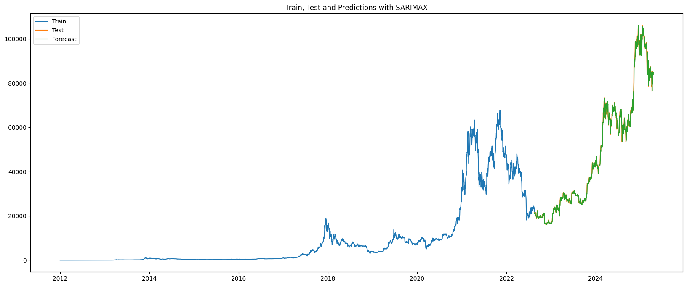

### Predicting tommorow's Bitcoin price.

**Author**
Shawn Arney

#### Executive summary
To predict tomorrow’s Bitcoin price, a benchmark and many regression models are evaluated to identify the best-performing one.

Benchmarking SARIMAX against SVR, linear, ridge, Lasso, random forest, gradient boosting, XGBoost, and an LSTM for next-day Bitcoin closing-price forecasting, SARIMAX achieved an MAE of $898.27 (MAPE 1.77%); the best alternative, Lasso, trimmed MAE by only $2 at the same MAPE. SARIMAX remains a robust baseline, with future work focusing on richer features and advanced ensembles to further reduce error.

#### Rationale
Forecasting Bitcoin’s future value is crucial for safeguarding one’s investments in Bitcoin.

#### Research Question
Predicting tomorrow's closing price for Bitcoin.

#### Data Sources
Data sources include Bitcoin historical pricing data.  For 1/1/2012 thru 4/18/2024.

Providing Bitcoin historical prices, volume data, and the funding rate for Bitcoin (Binance Futures, cost to borrow Bitcoin).  

*Including these data sources:*
Bitcoin Historical Data:
- https://github.com/ff137/bitstamp-btcusd-minute-data

Additional Funding Rate Data, from Binance Futures API:
- https://github.com/jesusgraterol/binance-futures-dataset-builder

#### Methodology
Bitcoin price prediction was approached from many different angles.  By exploring various regression models using supervised learning.  

And by using **GridsearchCV** with **cross validation of 5**, to tune parameters for evaluated models.  And **neg_mean_absolute_error** and **mean_absolute_error** were used for model evaluation.

*And includes:*

**Data Cleanup and Feature Selection:**
- Data Import from CSV Data Sources and Exchange API's
- Data cleanup, including dropping duplicates and setting Null values to 0
- Data aggregation of bitcoin minute data to daily data
- Data Feature Engineering columns 
- Data is split into training and test splits, with 20% set aside for testing
- And Data is encoded with a standard scaler for model processing

**Analysis includes:**
- Variance-Covariance matrixes to determine correlations with column features
- Cross Validation of 5 and neg_mean_absolute error and mean_absolute_error for model evaluation

**Models Evaluated Include:**
- Sarimax
- GridSearchCV for:
    - Support Vector Regression 
    - Linear Regression 
    - Ridge Regression
    - Lasso Regression 
    - Random Forest Regressor
    - Gradient Boosting Regressor
    - XGBoost Regressor
- Hyperband tuner for: 
    - Long Short-Term Memory (LSTM) Model

#### Results
Predicting the next day’s Bitcoin closing price on a daily timeframe, our SARIMAX baseline achieved a MAPE of 1.77% and an MAE of $898.27. 

A Lasso regression model offered only a marginal improvement—reducing MAE by about $2—while matching the same 1.77% MAPE. 

Overall, SARIMAX remains a strong benchmark for daily Bitcoin price forecasts.

#### Next steps
Either the SARIMAX model or the Lasso regression can be used to forecast tomorrow’s Bitcoin closing price, with an expected mean absolute error of ~$898.27.

#### Outline of project

- [Bitcoin Notebook](https://github.com/shawnarneygit/ai_machine_learning/blob/master/bitcoin/bitcoin.ipynb)

##### Contact and Further Information
Shawn Arney
Shawn@ArneyConsulting.com

https://www.linkedin.com/in/shawnarney/
