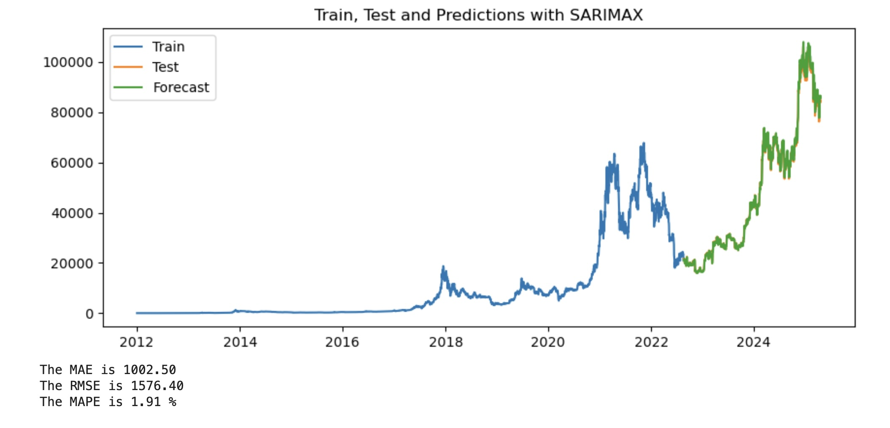

### Predicting tommorow's Bitcoin price.

**Author**
Shawn Arney

#### Executive summary

#### Rationale
Forecasting Bitcoin’s future value is crucial for safeguarding one’s investments in Bitcoin.

#### Research Question
Predicting the tomorrow's closing price for Bitcoin

#### Data Sources
Data sources include Bitcoin historical pricing data. 

Providing Bitcoin historical prices, volume data, and the funding rate for Bitcoin (Binance Futures, cost to borrow).  

*Including these data sources:*
Bitcoin Historical Data:
- https://github.com/ff137/bitstamp-btcusd-minute-data

Additional Funding Rate Data, from Binance Futures API:
- https://github.com/jesusgraterol/binance-futures-dataset-builder

#### Methodology
Bitcoin price prediction will be approached from many different angles.  

*And includes:

Data import and clean up from exchange api's and csv data sources.

Variance-Covariance matrixes to determine correlations with features.

Time-series Forecasting.

Model Explorations Include:
Sarimax
GridSearchCV, Linear Regression, Ridge and Lasso Regression, Random Forest Regressor, Gradient Boosting Regressor, XGBoost Regressor

Support Vector Regression Model.

Hyperband tuner, Long Short-Term Memory (LSTM) Model

#### Results
Predicting tomorrow's closing price of Bitcoin, for a daily time frame.

Initial Model using SARIMAX has a Mean Absolute Percentage Error (MAPE) of 1.77%.
The Mean Absolute Error (MAE) is 898.27.

What this means in dollar terms is that our initial model, has an error rate within $898.27 US Dollars.

#### Next steps
What suggestions do you have for next steps?

#### Outline of project

- [Bitcoin Notebook](https://github.com/shawnarneygit/ai_machine_learning/blob/master/bitcoin/bitcoin.ipynb)

##### Contact and Further Information
Shawn Arney
Shawn@ArneyConsulting.com

https://www.linkedin.com/in/shawnarney/
