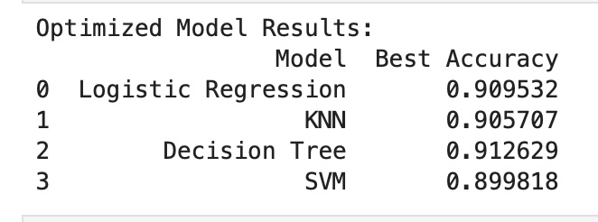
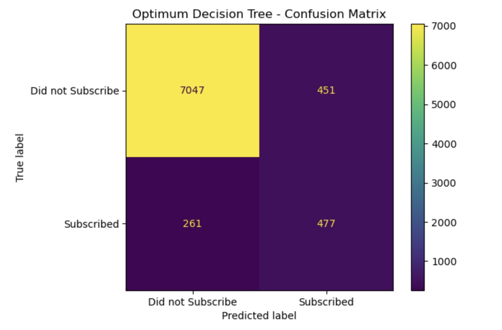

# During a marketing campaign, will a bank client subscribe to a term deposit?

**Jupyter Notebook with code, and data visualizations and analysis: [here](https://github.com/shawnarneygit/ai_machine_learning/blob/master/coupons.ipynb).**

## Business Goal
In order to focus effort and limited resources on the most likely bank clients for marketing campaign.

The business goal is to discover what bank client characteristics and features are most likely to subscribe to a term deposit.

## Data
Our dataset comes from the UCI Machine Learning repository [link](https://archive.ics.uci.edu/ml/datasets/bank+marketing).  The data is from a Portugese banking institution and is a collection of the results of multiple marketing campaigns.  We will make use of the article accompanying the dataset [here](CRISP-DM-BANK.pdf) for more information on the data and features.

## Modeling and performance
Logistic Regression, KNN algorithm, Decision Tree, and SVM models were compared to determine the most accurate and performant model.

A Confusion Matrix and a Table comparing scores and processing times.  Were employed to visualize and compare these percentages between different characteristics and features.

# Conclusions and Findings

## Best Model for Marketing Campaigns 

### Key Findings:
1. **Best Model for Marketing Campaigns**:
   - The Decision Tree Model.  With a max depth of 5.  Had the best predictive accuracy at 91%.  Compared to Logistic Regression, KNN Algorithm and SVM models.
   

### Conclusion:
Using a Decision Tree Model can narrow the focus for marketing campaigns, on the most likely candidates.  In order to save valuable resources and time, on the most likely candidates to purchase a term deposit.

### Actionable insights

- **Use a Decision Tree Model** To narrow the list of bank clients for a marketing campaign.  To the most likely candidates who will purchase a term deposit.

