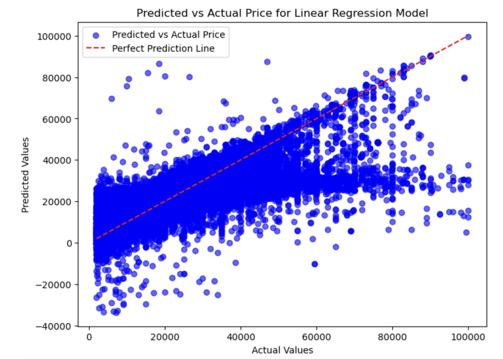
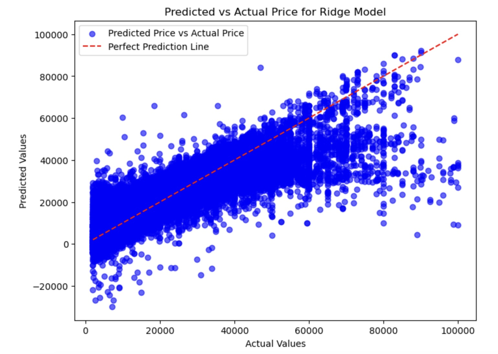

#### The Business Problem
For dealerships to determine the vehicles features, that drive used car prices.  

We use a dataset of used car features and prices.  To analyze and create a model.  To determine the predictive features for used car prices.  

**Jupyter Notebook with code, and data visualizations and analysis: [here](used_car_prices.ipynb).**

## Business Goal
Determine the predictive features for used car prices.

## Data
The dataset is from Kaggle. The original dataset contained information on 3 million used cars. The provided dataset contains information on 426K cars to ensure speed of processing.

[Vehicle dataset](data/vehicles.csv)

## Modeling and performance
To determine the features that most impact the pricing of used cars.  

The Linear Regression, Ridge Regression and SequentialFeatureSelector Models were used.

# Conclusions and Findings

### The most important characteristics for the Price of a used car is:

##### The mileage, year, manufacturer, and the region it is sold in.  
Then the model of vehicle. And 4 cylinder and 8 cyclinder vehicles are preferred. Vehicles with diesel, 4 wheel drive and full sized demand the highest prices.

Followed by convertibles, coupes and then pickups.
### Actionable insights

Prioritize mileage, year, and manufacturer.  This will impact the price of a used car, the most.

